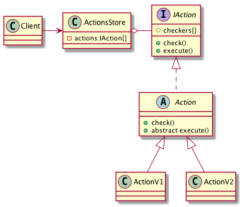

# Chain of Responsibility - Цепочка обязанностей

## Проблема

* Запрос должен быть обработан несколькими объектами

## Решение

* Логично использовать данный паттерн, если иммеется болле одного объекта, способного
    обработать запрос и обработчик заранее не известен или если весь набор объектов
    должен задаваться автоматически

## Плюсы

* Инкапсуляция реализации различных алгоритмов, система становится независимой от возможных
    изменений бизнес-правил
* Вызов всех алгоритмов одним стандартным способом
* Отказ от использования switch и if

## Преимущества

* Ослабляет связность (объект не обязан знать, кто именно обработает запрос)

## Недостатки

* Нет гарантий, что запрос будет обработан, поскольку он не имеет явного получателя

## Диаграмма

## Ссылки

* https://youtu.be/eU_ga-iwm8M?t=7m0s