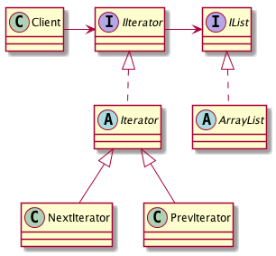

# Iterator, Cursor - Итератор, Курсор

## Проблема

* Составной объект, например список, должен предоставлять доступ к своим элементом, 
    не раскрывая их внутреннюю структуру, причем переберать список требуется поразному,
    в зависимости от задачи

## Решение

* Создается класс "Итератор", который определяет интерфейс для доступа и перебора элементов,
    "КонкретныйИтератор" реализует интерфейс класса "Итератор" и следит за текущей позицией
    при обходе Агрегата
* Агрегат определяет интерфейс для создания объекта-итератора
* "КонкретныйАгрегат" реализует интерфейс создания итератора и возвращает экземпляр класса
    "КонкретныйИтератор", который отслеживает текущий объект в агрегате и может вычислить 
    следубший объект при переборе
    
## Решение

* Поддерживает различные способы перебора агрегата
* Одновременно могут быть активны несколько переборов
    
## Диаграмма

## Ссылки

* https://youtu.be/q07bNoScd2s