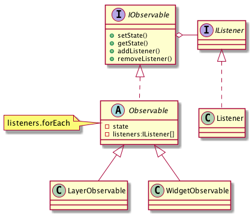

# Observer, Publish/Subscribe, Delegation Event Model

Если у объекта возникает несколько типов событий, это намекает на то, что класс перегружен

## Проблема

* Один объект должен знать об изменении состояний или событиях другово объекта. При этом
    необходимо поддерживать низкий уровень связывания с объектом

## Решение

* Определить интерфейс "Подписки". Объекты-подписчики реализуют этот интерфейс
    и динамически регистрируются для получения информации о событии. Зачем, при
    реализации условного события оповещаются все объекты-подписчики

## Область применения

* Существует как минимум один объект, рассылающий сообщения
* Имеет не менее одного получателя сообщений, причем их количество и состав
    могут измениться во время выполнения

## Диаграмма

## Ссылки

* https://youtu.be/q07bNoScd2s?t=41m44s