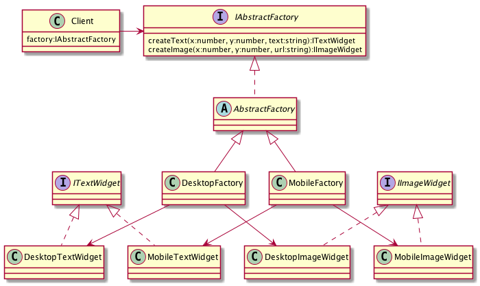

# Abstract Factory, Factory, Kit - Абстрактная фабрика

## Проблема

* Создать семейство взаимосвязанных или взаимозависимых объектов (не специфицируя их конкретных классов)
    
## Решение

* Создать абстрактный класс, в котором объявлен интерфейс для создания конкретных классов
    
## Преимущества
 
* Изолирует конкретные классы. Поскольку "Абстрактная фабрика" инкапсулирует ответственность за создание классов,
    то она изолирует клиент от деталей реализации классов
* Упрощена замена "Абстрактной фабрики", поскольку она используется только один раз во время инстанцирования

## Недостатки

* Интерфейс "Абстрактной фабрики" фиксирует набор объектов, которые можно создать. Расширение,
    для изготовления новых объектов, часто затруднительно
    
## Применимость

* Великолепно - если изменению подвержено количество фабрик
* Ужасно - если изменению подвержено количество создаваемых элементов в фабриках

## Диаграмма

## Ссылки

* https://youtu.be/dYNvK04q77w