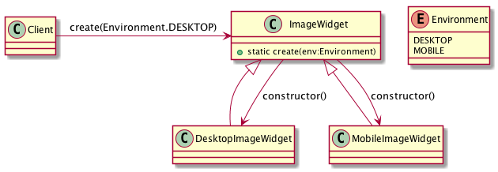

# Factory Method, Virtual Constructor - Фабричный метод, Виртуальный конструктор

## Проблема

* Определить интерфейс для создания объекта, но оставить подклассам решение о том,
    какой класс инстанцировать, то есть, делегировать инстанцирование подклассам
    
## Используется, когда

* Классу заранее не известно, объекты каких подклассов ему нужно создавать
    
## Преимущества
 
* Избавляет проектировщика от необходимости встаивать в код зависящие от приложения классы (в Client)

## Недостатки

* Возникает дополнительный уровень зависимостей
    
## Применимость

* Хорошо - изменению подвержено количество создаваемых элементов в фабриках,
    см [Abstract Factory](../abstractfactory)

## Диаграмма

## Ссылки
* https://youtu.be/dYNvK04q77w?t=31m55s