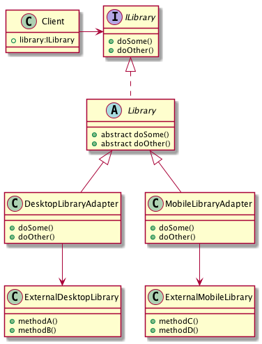

##Адаптер класса (Class Adapter)

Поскольку в TypeScript отсутствует закрытое наследование, 
требуется явно указать тип переменной

##Адаптер объектов (Objects Adapter)

# Adapter - Адаптер

## Проблема

* Необходимо обеспечить взаимодействие несовместимых интерфейсов или как создать единый
    устойчивый интерфейс для нескольких компонентов с разными интерфейсами
    
## Решение

* Конвертировать исходный интерфейс компонента к другому виду с помощью промежуточного
    объекта - _адаптера_. То есть, добавить специальный объект с общим интерфейсом в рамках
    данного приложения и перенаправить связи от внешних объектов к этому объекту - _адаптеру_
    
## Применяется в случае

* Система поддерживает требуемые данные и поведение, но имеет неподходящий интерфейс

## Плюсы

* Инкапсуляция реализации внешних классов, система становится независмой от их интерфейсов
* Переход на использование других внешних классов не требует переделки самой системы,
    достаточно реализовать один класс _Adapter_

## Диаграмма

## Ссылки

* https://youtu.be/gCLePmhzy9o?t=4m48s
* https://habrahabr.ru/post/85095/