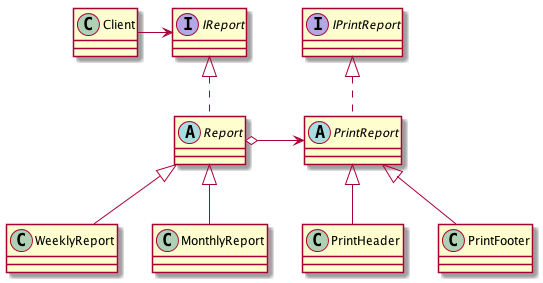

# Bridge, Handle, Body - Мост, Описатель, Тело

я не понял :(

## Проблема

* Требуется отделить абстракцию от реализации так, чтобы и то и другое можно было изменить
    независимо. При ипользовании наследования реализация жество привязывается к абстракции,
    что затрудняет независимую модификацию

## Проблема

* Поместить абстрацию и реализацию в отдельные иерархии классов

## Преимущества

* Отделение реализации от интерфейса, то есть, "Реализацию" "Абстракции" можно конфигурировать
    во время выполнения
* Разделение классов "Абстракцию" и "Реализация" устраняет зависимости от реализации,
    устанавливаемые на этапе компиляции: чтобы изменить класс "Реализация" вовсе не обязательно
    перекомпилировать
    
## Диаграмма

## Ссылки

* https://youtu.be/q07bNoScd2s