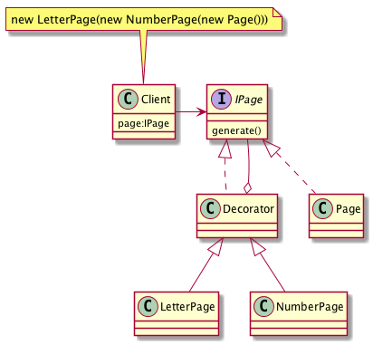

# Decorator, Wrapper

## Проблема

* Возложить ополнительные обязанности (прозрачные для клиента) на отдельный объект,
    а не класс вцелом
    
## Рекомендации

* Применение нескольких "Декораторов" к одному "Компоненту" позволяет произвольным образом
    сочетать обязанности, например, одно свойство можно добавить дважды

## Решение

    
## Применяется в случае

## Плюсы

## Диаграмма

## Ссылки

* https://youtu.be/gCLePmhzy9o?t=22m53s