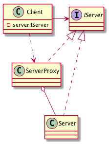

# Proxy, Surrogate - Заместитель, Суррогат

## Проблема

* Необходимо управлять доступом к объекту, так чтобы создавать громоздкие объекты "по требованию"
    
## Решение

    
## Применяется в случае

## Плюсы

## Диаграмма

## Ссылки

* https://youtu.be/gCLePmhzy9o?t=16m25s